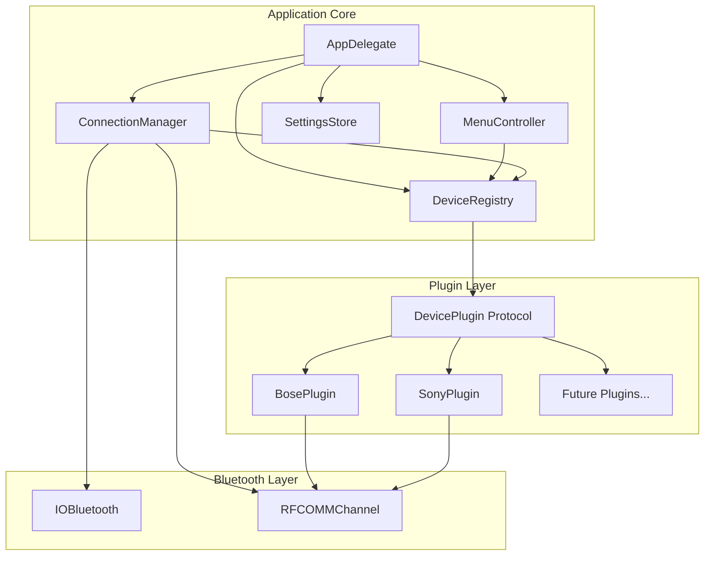

# Design Document: Multi-Device Support

## Overview

This design transforms the HeadphoneBattery application from a monolithic Bose-specific implementation into a modular, plugin-based architecture. The core principle is separation of concerns: the application core handles UI, connection management, and plugin orchestration, while device-specific logic lives in self-contained plugins.

The architecture follows a capability-based model where each device plugin declares what features it supports, and the UI dynamically adapts to show only relevant controls.

## Architecture



### Component Responsibilities

1. **AppDelegate**: Application lifecycle, timer management, coordinates other components
2. **MenuController**: Builds and updates the menu bar UI based on device capabilities
3. **ConnectionManager**: Bluetooth discovery, connection lifecycle, RFCOMM channel management
4. **DeviceRegistry**: Plugin discovery, device-to-plugin matching, plugin lifecycle
5. **SettingsStore**: Persists and retrieves device-specific settings
6. **DevicePlugin**: Protocol defining the contract for device-specific implementations

## Components and Interfaces

### DevicePlugin Protocol

The core abstraction that all device plugins must implement:

```swift
/// Represents a capability that a device may support
enum DeviceCapability: String, CaseIterable, Codable {
    case battery
    case noiseCancellation
    case selfVoice
    case autoOff
    case voicePrompts
    case language
    case pairedDevices
    case buttonAction
    case ambientSound
    case equalizerPresets
}

/// Information used to identify a device
struct DeviceIdentifier {
    let vendorId: String?
    let productId: String?
    let namePattern: String  // Regex pattern for device name matching
    let confidenceScore: Int // Higher = more specific match (0-100)
}

/// Result of a command execution
enum CommandResult {
    case success(Data?)
    case failure(DeviceError)
}

/// Errors that can occur during device communication
enum DeviceError: Error {
    case notConnected
    case commandTimeout
    case invalidResponse
    case unsupportedCommand
    case channelClosed
}

/// Protocol that all device plugins must implement
protocol DevicePlugin: AnyObject {
    /// Unique identifier for this plugin
    var pluginId: String { get }
    
    /// Human-readable name for this plugin
    var displayName: String { get }
    
    /// Device identifiers this plugin can handle
    var supportedDevices: [DeviceIdentifier] { get }
    
    /// Capabilities this plugin supports
    var capabilities: Set<DeviceCapability> { get }
    
    /// Check if this plugin can handle the given device
    func canHandle(device: BluetoothDevice) -> Int? // Returns confidence score or nil
    
    /// Initialize connection with the device
    func connect(channel: RFCOMMChannelWrapper) async throws
    
    /// Disconnect from the device
    func disconnect()
    
    /// Get current battery level (0-100)
    func getBatteryLevel() async throws -> Int
    
    /// Get noise cancellation level
    func getNoiseCancellation() async throws -> NoiseCancellationLevel
    
    /// Set noise cancellation level
    func setNoiseCancellation(_ level: NoiseCancellationLevel) async throws
    
    /// Get self-voice level (if supported)
    func getSelfVoice() async throws -> SelfVoiceLevel
    
    /// Set self-voice level (if supported)
    func setSelfVoice(_ level: SelfVoiceLevel) async throws
    
    /// Get auto-off setting
    func getAutoOff() async throws -> AutoOffSetting
    
    /// Set auto-off setting
    func setAutoOff(_ setting: AutoOffSetting) async throws
    
    /// Get paired devices list
    func getPairedDevices() async throws -> [PairedDevice]
    
    /// Connect to a paired device
    func connectPairedDevice(address: String) async throws
    
    /// Disconnect a paired device
    func disconnectPairedDevice(address: String) async throws
    
    /// Get current language setting
    func getLanguage() async throws -> DeviceLanguage
    
    /// Set language
    func setLanguage(_ language: DeviceLanguage) async throws
    
    /// Get voice prompts enabled state
    func getVoicePromptsEnabled() async throws -> Bool
    
    /// Set voice prompts enabled state
    func setVoicePromptsEnabled(_ enabled: Bool) async throws
    
    /// Get button action setting
    func getButtonAction() async throws -> ButtonActionSetting
    
    /// Set button action
    func setButtonAction(_ action: ButtonActionSetting) async throws
}

/// Default implementations for optional capabilities
extension DevicePlugin {
    func getSelfVoice() async throws -> SelfVoiceLevel {
        throw DeviceError.unsupportedCommand
    }
    
    func setSelfVoice(_ level: SelfVoiceLevel) async throws {
        throw DeviceError.unsupportedCommand
    }
    
    func getAutoOff() async throws -> AutoOffSetting {
        throw DeviceError.unsupportedCommand
    }
    
    func setAutoOff(_ setting: AutoOffSetting) async throws {
        throw DeviceError.unsupportedCommand
    }
    
    func getPairedDevices() async throws -> [PairedDevice] {
        throw DeviceError.unsupportedCommand
    }
    
    func connectPairedDevice(address: String) async throws {
        throw DeviceError.unsupportedCommand
    }
    
    func disconnectPairedDevice(address: String) async throws {
        throw DeviceError.unsupportedCommand
    }
    
    func getLanguage() async throws -> DeviceLanguage {
        throw DeviceError.unsupportedCommand
    }
    
    func setLanguage(_ language: DeviceLanguage) async throws {
        throw DeviceError.unsupportedCommand
    }
    
    func getVoicePromptsEnabled() async throws -> Bool {
        throw DeviceError.unsupportedCommand
    }
    
    func setVoicePromptsEnabled(_ enabled: Bool) async throws {
        throw DeviceError.unsupportedCommand
    }
    
    func getButtonAction() async throws -> ButtonActionSetting {
        throw DeviceError.unsupportedCommand
    }
    
    func setButtonAction(_ action: ButtonActionSetting) async throws {
        throw DeviceError.unsupportedCommand
    }
}
```

### DeviceRegistry

Manages plugin discovery and device-to-plugin matching:

```swift
/// Registry that manages device plugins
class DeviceRegistry {
    private var plugins: [DevicePlugin] = []
    private var activePlugin: DevicePlugin?
    
    /// Register a plugin with the registry
    func register(plugin: DevicePlugin)
    
    /// Find the best matching plugin for a device
    func findPlugin(for device: BluetoothDevice) -> DevicePlugin?
    
    /// Get the currently active plugin
    func getActivePlugin() -> DevicePlugin?
    
    /// Activate a plugin for a connected device
    func activatePlugin(_ plugin: DevicePlugin, for device: BluetoothDevice)
    
    /// Deactivate the current plugin
    func deactivatePlugin()
    
    /// Get all registered plugins
    func getAllPlugins() -> [DevicePlugin]
}
```

### ConnectionManager

Handles Bluetooth connection lifecycle:

```swift
/// Wrapper around IOBluetooth RFCOMM channel
class RFCOMMChannelWrapper {
    /// Send data and wait for response
    func sendCommand(_ data: Data, expectedPrefix: Data?, timeout: TimeInterval) async throws -> Data
    
    /// Check if channel is open
    var isOpen: Bool { get }
    
    /// Close the channel
    func close()
}

/// Manages Bluetooth connections
class ConnectionManager {
    weak var delegate: ConnectionManagerDelegate?
    
    /// Start scanning for supported devices
    func startScanning()
    
    /// Stop scanning
    func stopScanning()
    
    /// Connect to a specific device
    func connect(to device: BluetoothDevice) async throws -> RFCOMMChannelWrapper
    
    /// Disconnect from current device
    func disconnect()
    
    /// Get current connection state
    var connectionState: ConnectionState { get }
}

protocol ConnectionManagerDelegate: AnyObject {
    func connectionManager(_ manager: ConnectionManager, didDiscover device: BluetoothDevice)
    func connectionManager(_ manager: ConnectionManager, didConnect device: BluetoothDevice)
    func connectionManager(_ manager: ConnectionManager, didDisconnect device: BluetoothDevice)
    func connectionManager(_ manager: ConnectionManager, didFailWith error: Error)
}

enum ConnectionState {
    case disconnected
    case connecting
    case connected(BluetoothDevice)
}
```

### MenuController

Builds UI based on device capabilities:

```swift
/// Controls the menu bar UI
class MenuController {
    private let statusItem: NSStatusItem
    private let registry: DeviceRegistry
    
    /// Rebuild menu for current device capabilities
    func rebuildMenu()
    
    /// Update battery display
    func updateBattery(level: Int)
    
    /// Update noise cancellation selection
    func updateNoiseCancellation(level: NoiseCancellationLevel)
    
    /// Update self-voice selection
    func updateSelfVoice(level: SelfVoiceLevel)
    
    /// Update paired devices list
    func updatePairedDevices(_ devices: [PairedDevice])
    
    /// Show disconnected state
    func showDisconnected()
    
    /// Show error state
    func showError(_ message: String)
}
```

### SettingsStore

Persists device settings:

```swift
/// Stores device-specific settings
class SettingsStore {
    /// Save settings for a device
    func save(settings: DeviceSettings, for deviceId: String) throws
    
    /// Load settings for a device
    func load(for deviceId: String) throws -> DeviceSettings?
    
    /// Delete settings for a device
    func delete(for deviceId: String) throws
}

/// Settings that can be persisted per device
struct DeviceSettings: Codable {
    var noiseCancellation: NoiseCancellationLevel?
    var selfVoice: SelfVoiceLevel?
    var autoOff: AutoOffSetting?
    var language: DeviceLanguage?
    var voicePromptsEnabled: Bool?
    var buttonAction: ButtonActionSetting?
    var customSettings: [String: String]  // For plugin-specific settings
}
```

## Data Models

### Common Types

```swift
/// Noise cancellation levels (common across brands)
enum NoiseCancellationLevel: String, Codable, CaseIterable {
    case off
    case low
    case medium
    case high
    case adaptive
}

/// Self-voice levels
enum SelfVoiceLevel: String, Codable, CaseIterable {
    case off
    case low
    case medium
    case high
}

/// Auto-off timer settings
enum AutoOffSetting: Int, Codable, CaseIterable {
    case never = 0
    case fiveMinutes = 5
    case twentyMinutes = 20
    case fortyMinutes = 40
    case sixtyMinutes = 60
    case oneEightyMinutes = 180
}

/// Device languages
enum DeviceLanguage: String, Codable, CaseIterable {
    case english, french, italian, german, spanish
    case portuguese, chinese, korean, polish, russian
    case dutch, japanese, swedish
}

/// Button action options
enum ButtonActionSetting: String, Codable, CaseIterable {
    case voiceAssistant
    case noiseCancellation
    case playPause
    case custom
}

/// Paired device information
struct PairedDevice: Codable, Identifiable {
    let id: String  // MAC address
    let name: String
    let isConnected: Bool
    let isCurrentDevice: Bool
    let deviceType: PairedDeviceType
}

/// Type of paired device (for icon selection)
enum PairedDeviceType: String, Codable {
    case iPhone, iPad, macBook, mac, appleWatch
    case appleTV, airPods, appleGeneric
    case windows, android, unknown
}

/// Bluetooth device information
struct BluetoothDevice {
    let address: String
    let name: String
    let vendorId: String?
    let productId: String?
    let isConnected: Bool
}
```

### Bose-Specific Types

```swift
/// Bose protocol command structure
struct BoseCommand {
    let functionBlock: UInt8
    let function: UInt8
    let operator_: UInt8
    let payload: Data
    
    func encode() -> Data
    static func decode(_ data: Data) -> BoseCommand?
}

/// Bose device models with their specific capabilities and protocol variations
enum BoseDeviceModel: String, CaseIterable {
    case qc35 = "QC35"
    case qc35ii = "QC35 II"
    case qc45 = "QC45"
    case nc700 = "NC 700"
    case qcUltra = "QC Ultra"
    
    /// Capabilities supported by this specific model
    var supportedCapabilities: Set<DeviceCapability> {
        switch self {
        case .qc35:
            return [.battery, .noiseCancellation, .autoOff, .language, .voicePrompts]
        case .qc35ii:
            return [.battery, .noiseCancellation, .selfVoice, .autoOff, 
                    .language, .voicePrompts, .pairedDevices, .buttonAction]
        case .qc45:
            return [.battery, .noiseCancellation, .selfVoice, .autoOff,
                    .language, .voicePrompts, .pairedDevices]
        case .nc700:
            return [.battery, .noiseCancellation, .selfVoice, .autoOff,
                    .language, .voicePrompts, .pairedDevices, .equalizerPresets]
        case .qcUltra:
            return [.battery, .noiseCancellation, .selfVoice, .ambientSound,
                    .autoOff, .language, .voicePrompts, .pairedDevices]
        }
    }
    
    /// NC levels supported by this model
    var supportedNCLevels: [NoiseCancellationLevel] {
        switch self {
        case .qc35, .qc35ii:
            return [.off, .low, .high]
        case .qc45, .nc700:
            return [.off, .low, .medium, .high]
        case .qcUltra:
            return [.off, .low, .medium, .high, .adaptive]
        }
    }
    
    /// Protocol version used by this model
    var protocolVersion: BoseProtocolVersion {
        switch self {
        case .qc35, .qc35ii, .qc45:
            return .v1  // Original SPP protocol
        case .nc700, .qcUltra:
            return .v2  // Updated protocol with different command structure
        }
    }
}

/// Protocol versions for different Bose generations
enum BoseProtocolVersion {
    case v1  // QC35/QC35II/QC45 - uses 4-byte header
    case v2  // NC700/QCUltra - uses extended header with checksums
}

/// Model-specific command encoder
protocol BoseCommandEncoder {
    func encodeNCCommand(level: NoiseCancellationLevel) -> Data
    func encodeSelfVoiceCommand(level: SelfVoiceLevel) -> Data
    func encodeAutoOffCommand(setting: AutoOffSetting) -> Data
    func encodeLanguageCommand(language: DeviceLanguage, voicePromptsEnabled: Bool) -> Data
    func encodeBatteryQuery() -> Data
    func encodePairedDevicesQuery() -> Data
}

/// V1 encoder for QC35/QC35II/QC45
class BoseV1CommandEncoder: BoseCommandEncoder {
    func encodeNCCommand(level: NoiseCancellationLevel) -> Data {
        // [0x01, 0x06, 0x02, 0x01, level_byte]
        let levelByte: UInt8 = switch level {
        case .off: 0x00
        case .low: 0x03
        case .high: 0x01
        default: 0x00
        }
        return Data([0x01, 0x06, 0x02, 0x01, levelByte])
    }
    // ... other encodings
}

/// V2 encoder for NC700/QCUltra
class BoseV2CommandEncoder: BoseCommandEncoder {
    func encodeNCCommand(level: NoiseCancellationLevel) -> Data {
        // Different command structure with checksum
        // Implementation varies by model
    }
    // ... other encodings
}
```

### Bose Plugin Architecture

The BosePlugin uses a strategy pattern to handle model-specific variations:

```swift
class BosePlugin: DevicePlugin {
    private var detectedModel: BoseDeviceModel?
    private var commandEncoder: BoseCommandEncoder?
    
    /// Detect the specific Bose model from device name
    private func detectModel(from deviceName: String) -> BoseDeviceModel? {
        let name = deviceName.lowercased()
        if name.contains("qc ultra") { return .qcUltra }
        if name.contains("nc 700") || name.contains("nc700") { return .nc700 }
        if name.contains("qc45") { return .qc45 }
        if name.contains("qc35 ii") || name.contains("qc35ii") { return .qc35ii }
        if name.contains("qc35") { return .qc35 }
        return nil
    }
    
    /// Get capabilities based on detected model
    var capabilities: Set<DeviceCapability> {
        return detectedModel?.supportedCapabilities ?? [.battery]
    }
    
    func connect(channel: RFCOMMChannelWrapper) async throws {
        // Detect model and select appropriate encoder
        if let model = detectedModel {
            commandEncoder = switch model.protocolVersion {
            case .v1: BoseV1CommandEncoder()
            case .v2: BoseV2CommandEncoder()
            }
        }
        // Initialize connection...
    }
    
    func setNoiseCancellation(_ level: NoiseCancellationLevel) async throws {
        guard let model = detectedModel else { throw DeviceError.notConnected }
        
        // Validate level is supported by this model
        guard model.supportedNCLevels.contains(level) else {
            throw DeviceError.unsupportedCommand
        }
        
        guard let encoder = commandEncoder else { throw DeviceError.notConnected }
        let command = encoder.encodeNCCommand(level: level)
        try await sendCommand(command)
    }
}
```
```

### Sony-Specific Types

```swift
/// Sony protocol command structure
struct SonyCommand {
    let dataType: UInt8
    let sequenceNumber: UInt8
    let payload: Data
    
    func encode() -> Data
    static func decode(_ data: Data) -> SonyCommand?
}

/// Sony device models with their specific capabilities
enum SonyDeviceModel: String, CaseIterable {
    case wh1000xm3 = "WH-1000XM3"
    case wh1000xm4 = "WH-1000XM4"
    case wh1000xm5 = "WH-1000XM5"
    case wf1000xm4 = "WF-1000XM4"
    case wf1000xm5 = "WF-1000XM5"
    
    /// Capabilities supported by this specific model
    var supportedCapabilities: Set<DeviceCapability> {
        switch self {
        case .wh1000xm3:
            return [.battery, .noiseCancellation, .ambientSound, .equalizerPresets]
        case .wh1000xm4:
            return [.battery, .noiseCancellation, .ambientSound, .autoOff,
                    .equalizerPresets, .voicePrompts]
        case .wh1000xm5:
            return [.battery, .noiseCancellation, .ambientSound, .autoOff,
                    .equalizerPresets, .voicePrompts, .pairedDevices]
        case .wf1000xm4:
            return [.battery, .noiseCancellation, .ambientSound, .equalizerPresets]
        case .wf1000xm5:
            return [.battery, .noiseCancellation, .ambientSound, .autoOff,
                    .equalizerPresets, .voicePrompts]
        }
    }
    
    /// NC levels supported by this model
    var supportedNCLevels: [NoiseCancellationLevel] {
        switch self {
        case .wh1000xm3, .wf1000xm4:
            return [.off, .low, .medium, .high]
        case .wh1000xm4, .wh1000xm5, .wf1000xm5:
            return [.off, .low, .medium, .high, .adaptive]
        }
    }
    
    /// Whether this is an over-ear (WH) or in-ear (WF) model
    var isOverEar: Bool {
        return self.rawValue.hasPrefix("WH")
    }
}

/// Sony uses different protocols for different generations
enum SonyProtocolVersion {
    case v1  // XM3 generation
    case v2  // XM4/XM5 generation with extended features
}

/// Model-specific command encoder for Sony
protocol SonyCommandEncoder {
    func encodeNCCommand(level: NoiseCancellationLevel) -> Data
    func encodeAmbientSoundCommand(level: Int) -> Data
    func encodeBatteryQuery() -> Data
}
```

### Sony Plugin Architecture

Similar to Bose, the Sony plugin adapts to model-specific variations:

```swift
class SonyPlugin: DevicePlugin {
    private var detectedModel: SonyDeviceModel?
    
    /// Detect the specific Sony model from device name
    private func detectModel(from deviceName: String) -> SonyDeviceModel? {
        let name = deviceName.uppercased()
        for model in SonyDeviceModel.allCases {
            if name.contains(model.rawValue) {
                return model
            }
        }
        return nil
    }
    
    /// Get capabilities based on detected model
    var capabilities: Set<DeviceCapability> {
        return detectedModel?.supportedCapabilities ?? [.battery]
    }
    
    func setNoiseCancellation(_ level: NoiseCancellationLevel) async throws {
        guard let model = detectedModel else { throw DeviceError.notConnected }
        
        // Validate level is supported by this model
        guard model.supportedNCLevels.contains(level) else {
            throw DeviceError.unsupportedCommand
        }
        
        // Encode and send model-appropriate command
        let command = encodeNCCommand(level: level, for: model)
        try await sendCommand(command)
    }
}
```


## Correctness Properties

*A property is a characteristic or behavior that should hold true across all valid executions of a system—essentially, a formal statement about what the system should do. Properties serve as the bridge between human-readable specifications and machine-verifiable correctness guarantees.*

### Property 1: Plugin Registration Validation

*For any* DevicePlugin submitted for registration, if the plugin does not implement all required protocol methods, the DeviceRegistry SHALL reject the registration and return an error.

**Validates: Requirements 1.4**

### Property 2: Device-Plugin Matching Selects Highest Confidence

*For any* BluetoothDevice and any set of registered DevicePlugins where multiple plugins return non-nil confidence scores for that device, the DeviceRegistry SHALL select the plugin with the highest confidence score.

**Validates: Requirements 2.1, 2.2, 2.3**

### Property 3: Capability-Based Menu Visibility

*For any* connected device with a set of capabilities C, the MenuController SHALL display exactly the menu items corresponding to capabilities in C, and *for any* disconnected state, all device-specific menu items SHALL be hidden.

**Validates: Requirements 3.2, 3.3, 3.4, 3.5**

### Property 4: Command Error Structure

*For any* command sent to a device that fails (timeout, invalid response, channel closed), the Protocol_Handler SHALL return a DeviceError with a specific failure reason that is not nil.

**Validates: Requirements 4.3**

### Property 5: Bose Command Round-Trip

*For any* valid Bose command type (noise cancellation, self-voice, auto-off, language, button action) and valid parameter values, encoding the command to bytes and then decoding those bytes SHALL produce an equivalent command structure.

**Validates: Requirements 5.2, 5.3, 5.4, 5.5, 5.7**

### Property 6: Bose Paired Device Parsing

*For any* valid Bose paired devices response containing N device entries, parsing the response SHALL produce exactly N PairedDevice objects with valid MAC addresses.

**Validates: Requirements 5.6**

### Property 7: Sony Device Identification

*For any* BluetoothDevice with a name matching the pattern "WH-1000XM[3-5]" or "WF-1000XM[4-5]", the SonyDevicePlugin.canHandle() SHALL return a non-nil confidence score.

**Validates: Requirements 6.1**

### Property 8: Sony NC Command Encoding

*For any* valid NoiseCancellationLevel, encoding a Sony NC command and decoding it SHALL produce the same level value.

**Validates: Requirements 6.3**

### Property 9: Connection Lifecycle Notifications

*For any* device connection event, the ConnectionManager SHALL call the DeviceRegistry's activatePlugin method exactly once, and *for any* device disconnection event, the ConnectionManager SHALL call deactivatePlugin exactly once.

**Validates: Requirements 7.1, 7.2**

### Property 10: Connection State Consistency

*For any* sequence of connect and disconnect operations, the ConnectionManager's connectionState property SHALL always reflect the actual connection status (connected devices are in Connected state, disconnected devices are in Disconnected state).

**Validates: Requirements 7.3**

### Property 11: Connection Retry Behavior

*For any* connection attempt that fails, the ConnectionManager SHALL retry with delays following exponential backoff (delay doubles each attempt) and SHALL stop after exactly 3 failed attempts.

**Validates: Requirements 7.4**

### Property 12: Settings Round-Trip

*For any* valid DeviceSettings object, serializing to JSON and deserializing back SHALL produce an equivalent DeviceSettings object (all fields match).

**Validates: Requirements 8.1, 8.2, 8.3**

### Property 13: Model-Specific Capability Filtering

*For any* Bose or Sony device model, the plugin's reported capabilities SHALL be a subset of that model's supportedCapabilities, and *for any* command for an unsupported capability, the plugin SHALL throw DeviceError.unsupportedCommand.

**Validates: Requirements 3.1, 5.1-5.7, 6.1-6.4**

## Error Handling

### Connection Errors

| Error Condition | Handling Strategy |
|----------------|-------------------|
| Bluetooth disabled | Display "Bluetooth Disabled" in menu, disable all device actions |
| Device not found | Display "No Device Found", continue scanning |
| RFCOMM channel open failed | Retry up to 3 times with exponential backoff |
| RFCOMM channel closed unexpectedly | Update UI to disconnected state, attempt reconnection |
| Command timeout | Return DeviceError.commandTimeout, allow retry |

### Plugin Errors

| Error Condition | Handling Strategy |
|----------------|-------------------|
| Plugin registration fails | Log error, continue with other plugins |
| Plugin throws during command | Catch error, return DeviceError, log details |
| No plugin matches device | Display as "Unsupported Device" with connection status only |

### Data Errors

| Error Condition | Handling Strategy |
|----------------|-------------------|
| Invalid response format | Return DeviceError.invalidResponse, log raw bytes |
| Settings file corrupted | Delete corrupted file, use defaults |
| Serialization fails | Log error, return nil settings |

## Testing Strategy

### Dual Testing Approach

This design requires both unit tests and property-based tests for comprehensive coverage:

- **Unit tests**: Verify specific examples, edge cases, and integration points
- **Property tests**: Verify universal properties across all valid inputs using randomized testing

### Property-Based Testing Configuration

- **Library**: SwiftCheck (Swift property-based testing library)
- **Minimum iterations**: 100 per property test
- **Tag format**: `Feature: multi-device-support, Property {number}: {property_text}`

### Test Categories

#### Unit Tests

1. **Plugin Registration**
   - Test registering valid plugins
   - Test rejecting plugins with missing methods
   - Test duplicate plugin handling

2. **Device Matching**
   - Test exact vendor/product ID match
   - Test name pattern matching with regex
   - Test no-match scenario

3. **Menu Building**
   - Test menu items for each capability
   - Test menu state after connect/disconnect
   - Test icon consistency

4. **Bose Protocol**
   - Test specific command bytes for NC levels
   - Test battery response parsing
   - Test paired device response parsing

5. **Sony Protocol**
   - Test Sony command structure
   - Test battery response parsing
   - Test NC command encoding

#### Property Tests

1. **Property 2: Device-Plugin Matching** - Generate random devices and plugin sets, verify highest confidence wins
2. **Property 3: Capability Menu Visibility** - Generate random capability sets, verify menu matches
3. **Property 5: Bose Command Round-Trip** - Generate random valid commands, verify encode/decode cycle
4. **Property 6: Bose Paired Device Parsing** - Generate random device lists, verify parsing
5. **Property 8: Sony NC Command Encoding** - Generate random NC levels, verify round-trip
6. **Property 11: Connection Retry Behavior** - Generate failure sequences, verify retry count and timing
7. **Property 12: Settings Round-Trip** - Generate random settings, verify serialization round-trip

### Test File Organization

```
Tests/
├── HeadphoneBatteryTests/
│   ├── DeviceRegistryTests.swift       # Unit tests for registry
│   ├── MenuControllerTests.swift       # Unit tests for menu
│   ├── ConnectionManagerTests.swift    # Unit tests for connections
│   ├── BosePluginTests.swift           # Unit tests for Bose protocol
│   ├── SonyPluginTests.swift           # Unit tests for Sony protocol
│   ├── SettingsStoreTests.swift        # Unit tests for persistence
│   └── PropertyTests/
│       ├── DeviceMatchingPropertyTests.swift
│       ├── MenuVisibilityPropertyTests.swift
│       ├── BoseCommandPropertyTests.swift
│       ├── SonyCommandPropertyTests.swift
│       ├── ConnectionRetryPropertyTests.swift
│       └── SettingsRoundTripPropertyTests.swift
```
