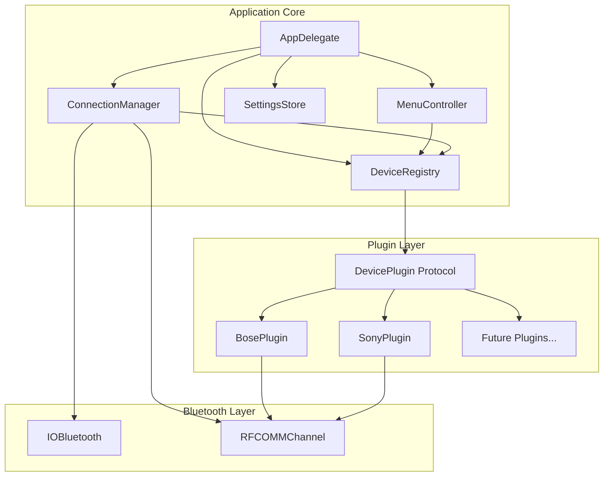

# Design Document: Multi-Device Support

## Overview

This design transforms the HeadphoneBattery application from a monolithic Bose-specific implementation into a modular, plugin-based architecture. The core principle is separation of concerns: the application core handles UI, connection management, and plugin orchestration, while device-specific logic lives in self-contained plugins.

The architecture follows a capability-based model where each device plugin declares what features it supports, and the UI dynamically adapts to show only relevant controls.

## Architecture



### Component Responsibilities

1. **AppDelegate**: Application lifecycle, timer management, coordinates other components, initiates plugin discovery at startup
2. **MenuController**: Builds and updates the menu bar UI based on device capabilities, handles error states and unsupported devices
3. **ConnectionManager**: Bluetooth discovery, connection lifecycle with retry logic, RFCOMM channel management, notifies registry of connection events
4. **DeviceRegistry**: Plugin discovery and dynamic loading, device-to-plugin matching with confidence scoring, plugin lifecycle management, validation of plugin interfaces
5. **SettingsStore**: Persists and retrieves device-specific settings with round-trip serialization support
6. **DevicePlugin**: Protocol defining the contract for device-specific implementations, encapsulates all protocol details

### Plugin Discovery and Dynamic Loading

The architecture supports dynamic plugin loading without requiring application recompilation:

1. **Plugin Directory Structure**: Plugins are stored in a designated plugins directory (e.g., `~/Library/Application Support/HeadphoneBattery/Plugins/`)
2. **Startup Discovery**: At application startup, the DeviceRegistry scans the plugins directory and loads all valid plugin files
3. **Runtime Loading**: New plugins added to the directory become available immediately through the registry's discovery mechanism
4. **Plugin Validation**: Each plugin is validated to ensure it implements all required protocol methods before registration
5. **Error Handling**: Invalid plugins are rejected with detailed error logging, allowing the application to continue with other plugins

## Components and Interfaces

### DevicePlugin Protocol

The core abstraction that all device plugins must implement:

```swift
/// Represents a capability that a device may support
enum DeviceCapability: String, CaseIterable, Codable {
    case battery
    case noiseCancellation
    case selfVoice
    case autoOff
    case voicePrompts
    case language
    case pairedDevices
    case buttonAction
    case ambientSound
    case equalizerPresets
}

/// Represents different types of capability values to handle device-specific variations
enum CapabilityValueType: Codable {
    case discrete([String])        // e.g., ["off", "low", "high"]
    case continuous(min: Int, max: Int, step: Int)  // e.g., 0-10 with step 1
    case boolean                   // e.g., on/off
    case text                      // e.g., language codes
}

/// Device-specific capability configuration
struct DeviceCapabilityConfig: Codable {
    let capability: DeviceCapability
    let valueType: CapabilityValueType
    let displayName: String
    let isSupported: Bool
    
    /// Device-specific metadata for this capability
    let metadata: [String: String]
}

/// Information used to identify a device with multiple identification strategies
struct DeviceIdentifier {
    let vendorId: String?           // Bluetooth vendor ID (e.g., "0x009E" for Bose)
    let productId: String?          // Bluetooth product ID
    let serviceUUIDs: [String]      // Bluetooth service UUIDs
    let namePattern: String?        // Regex pattern for device name (fallback only)
    let macAddressPrefix: String?   // MAC address prefix for specific models
    let confidenceScore: Int        // Higher = more specific match (0-100)
    
    /// Additional device-specific identifiers
    let customIdentifiers: [String: String]  // e.g., ["firmwareSignature": "BOSE_QC35"]
}

/// Generic communication interface to support different transport protocols
protocol DeviceCommunicationChannel {
    /// Send data and wait for response
    func sendCommand(_ data: Data, expectedPrefix: Data?, timeout: TimeInterval) async throws -> Data
    
    /// Check if channel is open
    var isOpen: Bool { get }
    
    /// Close the channel
    func close()
    
    /// Get channel type identifier
    var channelType: String { get }
}

/// RFCOMM implementation of communication channel
class RFCOMMChannel: DeviceCommunicationChannel {
    let channelType = "RFCOMM"
    // ... RFCOMM-specific implementation
}

/// Future: BLE implementation
class BLEChannel: DeviceCommunicationChannel {
    let channelType = "BLE"
    // ... BLE-specific implementation
}

/// Result of a command execution with device-specific data
enum CommandResult {
    case success(Data?)
    case failure(DeviceError)
}

/// Errors that can occur during device communication
enum DeviceError: Error {
    case notConnected
    case commandTimeout
    case invalidResponse
    case unsupportedCommand
    case channelClosed
    case unsupportedChannel(String)
}

/// Protocol that all device plugins must implement
protocol DevicePlugin: AnyObject {
    /// Unique identifier for this plugin
    var pluginId: String { get }
    
    /// Human-readable name for this plugin
    var displayName: String { get }
    
    /// Device identifiers this plugin can handle
    var supportedDevices: [DeviceIdentifier] { get }
    
    /// Get device-specific capability configurations
    func getCapabilityConfigs(for device: BluetoothDevice) -> [DeviceCapabilityConfig]
    
    /// Get supported communication channel types
    var supportedChannelTypes: [String] { get }
    
    /// Check if this plugin can handle the given device
    func canHandle(device: BluetoothDevice) -> Int? // Returns confidence score or nil
    
    /// Initialize connection with the device using appropriate channel
    func connect(channel: DeviceCommunicationChannel) async throws
    
    /// Disconnect from the device
    func disconnect()
    
    /// Get current battery level (0-100)
    func getBatteryLevel() async throws -> Int
    
    /// Get device-specific additional info (varies per device)
    func getDeviceInfo() async throws -> [String: Any]
    
    /// Get noise cancellation value in device-native format
    func getNoiseCancellation() async throws -> Any
    
    /// Set noise cancellation using device-native value
    func setNoiseCancellation(_ value: Any) async throws
    
    /// Convert device-native NC value to standardized format for UI
    func convertNCToStandard(_ deviceValue: Any) -> String
    
    /// Convert standardized NC value to device-native format
    func convertNCFromStandard(_ standardValue: String) -> Any
    
    /// Get self-voice level (if supported)
    func getSelfVoice() async throws -> Any
    
    /// Set self-voice level (if supported)
    func setSelfVoice(_ value: Any) async throws
    
    /// Get auto-off setting
    func getAutoOff() async throws -> AutoOffSetting
    
    /// Set auto-off setting
    func setAutoOff(_ setting: AutoOffSetting) async throws
    
    /// Get paired devices list
    func getPairedDevices() async throws -> [PairedDevice]
    
    /// Connect to a paired device
    func connectPairedDevice(address: String) async throws
    
    /// Disconnect a paired device
    func disconnectPairedDevice(address: String) async throws
    
    /// Get current language setting
    func getLanguage() async throws -> DeviceLanguage
    
    /// Set language
    func setLanguage(_ language: DeviceLanguage) async throws
    
    /// Get voice prompts enabled state
    func getVoicePromptsEnabled() async throws -> Bool
    
    /// Set voice prompts enabled state
    func setVoicePromptsEnabled(_ enabled: Bool) async throws
    
    /// Get button action setting
    func getButtonAction() async throws -> ButtonActionSetting
    
    /// Set button action
    func setButtonAction(_ action: ButtonActionSetting) async throws
}

/// Default implementations for optional capabilities
extension DevicePlugin {
    func getSelfVoice() async throws -> SelfVoiceLevel {
        throw DeviceError.unsupportedCommand
    }
    
    func setSelfVoice(_ level: SelfVoiceLevel) async throws {
        throw DeviceError.unsupportedCommand
    }
    
    func getAutoOff() async throws -> AutoOffSetting {
        throw DeviceError.unsupportedCommand
    }
    
    func setAutoOff(_ setting: AutoOffSetting) async throws {
        throw DeviceError.unsupportedCommand
    }
    
    func getPairedDevices() async throws -> [PairedDevice] {
        throw DeviceError.unsupportedCommand
    }
    
    func connectPairedDevice(address: String) async throws {
        throw DeviceError.unsupportedCommand
    }
    
    func disconnectPairedDevice(address: String) async throws {
        throw DeviceError.unsupportedCommand
    }
    
    func getLanguage() async throws -> DeviceLanguage {
        throw DeviceError.unsupportedCommand
    }
    
    func setLanguage(_ language: DeviceLanguage) async throws {
        throw DeviceError.unsupportedCommand
    }
    
    func getVoicePromptsEnabled() async throws -> Bool {
        throw DeviceError.unsupportedCommand
    }
    
    func setVoicePromptsEnabled(_ enabled: Bool) async throws {
        throw DeviceError.unsupportedCommand
    }
    
    func getButtonAction() async throws -> ButtonActionSetting {
        throw DeviceError.unsupportedCommand
    }
    
    func setButtonAction(_ action: ButtonActionSetting) async throws {
        throw DeviceError.unsupportedCommand
    }
}
```

### DeviceRegistry

Manages plugin discovery and device-to-plugin matching:

```swift
/// Registry that manages device plugins
class DeviceRegistry {
    private var plugins: [DevicePlugin] = []
    private var activePlugin: DevicePlugin?
    private let pluginsDirectory: URL
    
    init(pluginsDirectory: URL = defaultPluginsDirectory)
    
    /// Discover and load all plugins from the plugins directory at startup
    func discoverAndLoadPlugins() throws
    
    /// Register a plugin with the registry (validates required methods are implemented)
    func register(plugin: DevicePlugin) throws
    
    /// Find the best matching plugin for a device (queries all plugins, selects highest confidence)
    func findPlugin(for device: BluetoothDevice) -> DevicePlugin?
    
    /// Get the currently active plugin
    func getActivePlugin() -> DevicePlugin?
    
    /// Activate a plugin for a connected device (called by ConnectionManager)
    func activatePlugin(_ plugin: DevicePlugin, for device: BluetoothDevice)
    
    /// Deactivate the current plugin (called by ConnectionManager on disconnect)
    func deactivatePlugin()
    
    /// Get all registered plugins
    func getAllPlugins() -> [DevicePlugin]
    
    /// Validate that a plugin implements all required protocol methods
    private func validatePlugin(_ plugin: DevicePlugin) throws
}
```

### ConnectionManager

Handles connection lifecycle with multiple transport protocols:

```swift
/// Factory for creating appropriate communication channels
class CommunicationChannelFactory {
    /// Create channel based on device requirements and available transports
    func createChannel(for device: BluetoothDevice, preferredTypes: [String]) throws -> DeviceCommunicationChannel
    
    /// Get available channel types for a device
    func getAvailableChannelTypes(for device: BluetoothDevice) -> [String]
}

/// Manages connections with support for multiple transport protocols
class ConnectionManager {
    weak var delegate: ConnectionManagerDelegate?
    private let registry: DeviceRegistry
    private let channelFactory: CommunicationChannelFactory
    private var connectionState: ConnectionState = .disconnected
    private let maxRetryAttempts = 3
    
    /// Start scanning for supported devices
    func startScanning()
    
    /// Stop scanning
    func stopScanning()
    
    /// Connect to a specific device (tries preferred channel types in order)
    func connect(to device: BluetoothDevice) async throws -> DeviceCommunicationChannel
    
    /// Disconnect from current device (notifies registry to deactivate plugin)
    func disconnect()
    
    /// Get current connection state (maintained and provided to MenuController)
    var connectionState: ConnectionState { get }
    
    /// Handle unexpected channel closure (updates UI to disconnected state)
    func handleChannelClosed()
    
    /// Retry connection with exponential backoff
    private func retryConnection(to device: BluetoothDevice, attempt: Int) async throws -> DeviceCommunicationChannel
}

protocol ConnectionManagerDelegate: AnyObject {
    func connectionManager(_ manager: ConnectionManager, didDiscover device: BluetoothDevice)
    func connectionManager(_ manager: ConnectionManager, didConnect device: BluetoothDevice)
    func connectionManager(_ manager: ConnectionManager, didDisconnect device: BluetoothDevice)
    func connectionManager(_ manager: ConnectionManager, didFailWith error: Error)
}

enum ConnectionState {
    case disconnected
    case connecting
    case connected(BluetoothDevice, DeviceCommunicationChannel)
}
```

### MenuController

Builds UI based on device-specific capability configurations:

```swift
/// Controls the menu bar UI with device-specific capability handling
class MenuController {
    private let statusItem: NSStatusItem
    private let registry: DeviceRegistry
    
    /// Rebuild menu for current device capabilities (queries plugin for device-specific configs)
    func rebuildMenu()
    
    /// Update battery display
    func updateBattery(level: Int)
    
    /// Update noise cancellation with device-specific value handling
    func updateNoiseCancellation(deviceValue: Any, config: DeviceCapabilityConfig)
    
    /// Update self-voice with device-specific value handling
    func updateSelfVoice(deviceValue: Any, config: DeviceCapabilityConfig)
    
    /// Update paired devices list
    func updatePairedDevices(_ devices: [PairedDevice])
    
    /// Display device-specific additional info
    func updateDeviceInfo(_ info: [String: Any])
    
    /// Show disconnected state (hides all device-specific menu items)
    func showDisconnected()
    
    /// Show error state with brief error indicator
    func showError(_ message: String)
    
    /// Show "Bluetooth Disabled" state
    func showBluetoothDisabled()
    
    /// Show "Unsupported Device" state with basic connection status only
    func showUnsupportedDevice(_ device: BluetoothDevice)
    
    /// Create menu item based on device-specific capability configuration
    private func createMenuItem(for config: DeviceCapabilityConfig) -> NSMenuItem
    
    /// Create control UI based on capability value type (discrete, continuous, boolean, text)
    private func createControlUI(for config: DeviceCapabilityConfig) -> NSView
}
```

### SettingsStore

Persists device settings:

```swift
/// Stores device-specific settings with round-trip serialization support
class SettingsStore {
    private let settingsDirectory: URL
    
    /// Save settings for a device (keyed by device identifier)
    func save(settings: DeviceSettings, for deviceId: String) throws
    
    /// Load settings for a device (restored when device reconnects)
    func load(for deviceId: String) throws -> DeviceSettings?
    
    /// Delete settings for a device
    func delete(for deviceId: String) throws
    
    /// Validate serialization format supports adding new setting types
    private func validateSerializationFormat() throws
}

/// Settings that can be persisted per device (supports round-trip serialization)
struct DeviceSettings: Codable {
    var noiseCancellation: NoiseCancellationLevel?
    var selfVoice: SelfVoiceLevel?
    var autoOff: AutoOffSetting?
    var language: DeviceLanguage?
    var voicePromptsEnabled: Bool?
    var buttonAction: ButtonActionSetting?
    var customSettings: [String: String]  // For plugin-specific settings
    
    /// Device identifier for keying settings
    let deviceId: String
    
    /// Timestamp for settings version tracking
    let lastModified: Date
}
```

## Data Models

### Common Types

```swift
/// Noise cancellation levels (common across brands)
enum NoiseCancellationLevel: String, Codable, CaseIterable {
    case off
    case low
    case medium
    case high
    case adaptive
}

/// Self-voice levels
enum SelfVoiceLevel: String, Codable, CaseIterable {
    case off
    case low
    case medium
    case high
}

/// Auto-off timer settings
enum AutoOffSetting: Int, Codable, CaseIterable {
    case never = 0
    case fiveMinutes = 5
    case twentyMinutes = 20
    case fortyMinutes = 40
    case sixtyMinutes = 60
    case oneEightyMinutes = 180
}

/// Device languages
enum DeviceLanguage: String, Codable, CaseIterable {
    case english, french, italian, german, spanish
    case portuguese, chinese, korean, polish, russian
    case dutch, japanese, swedish
}

/// Button action options
enum ButtonActionSetting: String, Codable, CaseIterable {
    case voiceAssistant
    case noiseCancellation
    case playPause
    case custom
}

/// Paired device information
struct PairedDevice: Codable, Identifiable {
    let id: String  // MAC address
    let name: String
    let isConnected: Bool
    let isCurrentDevice: Bool
    let deviceType: PairedDeviceType
}

/// Type of paired device (for icon selection)
enum PairedDeviceType: String, Codable {
    case iPhone, iPad, macBook, mac, appleWatch
    case appleTV, airPods, appleGeneric
    case windows, android, unknown
}

/// Enhanced Bluetooth device information
struct BluetoothDevice {
    let address: String             // MAC address
    let name: String               // User-changeable name
    let vendorId: String?          // Bluetooth vendor ID
    let productId: String?         // Bluetooth product ID
    let serviceUUIDs: [String]     // Available Bluetooth services
    let isConnected: Bool
    let rssi: Int?                 // Signal strength
    let deviceClass: UInt32?       // Bluetooth device class
    
    /// Additional low-level identifiers
    let manufacturerData: Data?    // Manufacturer-specific data
    let advertisementData: [String: Any]?  // BLE advertisement data
}
```

### Bose-Specific Types

```swift
/// Bose protocol command structure
struct BoseCommand {
    let functionBlock: UInt8
    let function: UInt8
    let operator_: UInt8
    let payload: Data
    
    func encode() -> Data
    static func decode(_ data: Data) -> BoseCommand?
}

/// Bose device models with their specific capabilities and protocol variations
enum BoseDeviceModel: String, CaseIterable {
    case qc35 = "QC35"
    case qc35ii = "QC35 II"
    case qc45 = "QC45"
    case nc700 = "NC 700"
    case qcUltra = "QC Ultra"
    
    /// Capabilities supported by this specific model
    var supportedCapabilities: Set<DeviceCapability> {
        switch self {
        case .qc35:
            return [.battery, .noiseCancellation, .autoOff, .language, .voicePrompts]
        case .qc35ii:
            return [.battery, .noiseCancellation, .selfVoice, .autoOff, 
                    .language, .voicePrompts, .pairedDevices, .buttonAction]
        case .qc45:
            return [.battery, .noiseCancellation, .selfVoice, .autoOff,
                    .language, .voicePrompts, .pairedDevices]
        case .nc700:
            return [.battery, .noiseCancellation, .selfVoice, .autoOff,
                    .language, .voicePrompts, .pairedDevices, .equalizerPresets]
        case .qcUltra:
            return [.battery, .noiseCancellation, .selfVoice, .ambientSound,
                    .autoOff, .language, .voicePrompts, .pairedDevices]
        }
    }
    
    /// NC levels supported by this model
    var supportedNCLevels: [NoiseCancellationLevel] {
        switch self {
        case .qc35, .qc35ii:
            return [.off, .low, .high]
        case .qc45, .nc700:
            return [.off, .low, .medium, .high]
        case .qcUltra:
            return [.off, .low, .medium, .high, .adaptive]
        }
    }
    
    /// Protocol version used by this model
    var protocolVersion: BoseProtocolVersion {
        switch self {
        case .qc35, .qc35ii, .qc45:
            return .v1  // Original SPP protocol
        case .nc700, .qcUltra:
            return .v2  // Updated protocol with different command structure
        }
    }
}

/// Protocol versions for different Bose generations
enum BoseProtocolVersion {
    case v1  // QC35/QC35II/QC45 - uses 4-byte header
    case v2  // NC700/QCUltra - uses extended header with checksums
}

/// Model-specific command encoder
protocol BoseCommandEncoder {
    func encodeNCCommand(level: NoiseCancellationLevel) -> Data
    func encodeSelfVoiceCommand(level: SelfVoiceLevel) -> Data
    func encodeAutoOffCommand(setting: AutoOffSetting) -> Data
    func encodeLanguageCommand(language: DeviceLanguage, voicePromptsEnabled: Bool) -> Data
    func encodeBatteryQuery() -> Data
    func encodePairedDevicesQuery() -> Data
}

/// V1 encoder for QC35/QC35II/QC45
class BoseV1CommandEncoder: BoseCommandEncoder {
    func encodeNCCommand(level: NoiseCancellationLevel) -> Data {
        // [0x01, 0x06, 0x02, 0x01, level_byte]
        let levelByte: UInt8 = switch level {
        case .off: 0x00
        case .low: 0x03
        case .high: 0x01
        default: 0x00
        }
        return Data([0x01, 0x06, 0x02, 0x01, levelByte])
    }
    // ... other encodings
}

/// V2 encoder for NC700/QCUltra
class BoseV2CommandEncoder: BoseCommandEncoder {
    func encodeNCCommand(level: NoiseCancellationLevel) -> Data {
        // Different command structure with checksum
        // Implementation varies by model
    }
    // ... other encodings
}
```

### Bose Plugin Architecture

The BosePlugin uses a hierarchical approach with base classes and device-specific subclasses:

```swift
/// Base class for all Bose devices with common functionality
class BosePlugin: DevicePlugin {
    let pluginId = "com.headphonebattery.bose"
    let displayName = "Bose Headphones"
    let supportedChannelTypes = ["RFCOMM"]
    
    /// Bose-specific device identifiers using multiple identification strategies
    let supportedDevices: [DeviceIdentifier] = [
        // QC35 identification
        DeviceIdentifier(
            vendorId: "0x009E",  // Bose vendor ID
            productId: "0x4001", // QC35 product ID
            serviceUUIDs: ["0000110B-0000-1000-8000-00805F9B34FB"], // Audio Sink
            namePattern: "Bose QC35.*",  // Fallback pattern
            macAddressPrefix: "04:52:C7", // Bose MAC prefix
            confidenceScore: 95,
            customIdentifiers: ["deviceFamily": "QC35"]
        ),
        // QC35 II identification
        DeviceIdentifier(
            vendorId: "0x009E",
            productId: "0x4002", // QC35 II has different product ID
            serviceUUIDs: ["0000110B-0000-1000-8000-00805F9B34FB"],
            namePattern: "Bose QC35 II.*",
            macAddressPrefix: "04:52:C7",
            confidenceScore: 95,
            customIdentifiers: ["deviceFamily": "QC35II", "hasGoogleAssistant": "true"]
        ),
        // QC Ultra identification
        DeviceIdentifier(
            vendorId: "0x009E",
            productId: "0x4010", // QC Ultra product ID
            serviceUUIDs: ["0000110B-0000-1000-8000-00805F9B34FB", "0000180F-0000-1000-8000-00805F9B34FB"], // Audio + Battery
            namePattern: "Bose QuietComfort Ultra.*",
            macAddressPrefix: "04:52:C7",
            confidenceScore: 98,
            customIdentifiers: ["deviceFamily": "QCUltra", "protocolVersion": "v2"]
        )
    ]
    
    protected var channel: DeviceCommunicationChannel?
    protected var deviceModel: BoseDeviceModel?
    protected var commandEncoder: BoseCommandEncoder?
    
    /// Enhanced device identification using multiple criteria
    func canHandle(device: BluetoothDevice) -> Int? {
        var bestScore = 0
        var matchedIdentifier: DeviceIdentifier?
        
        for identifier in supportedDevices {
            var score = 0
            
            // Primary identification: Vendor + Product ID (highest confidence)
            if let deviceVendorId = device.vendorId,
               let deviceProductId = device.productId,
               let identifierVendorId = identifier.vendorId,
               let identifierProductId = identifier.productId,
               deviceVendorId == identifierVendorId && deviceProductId == identifierProductId {
                score += 80
            }
            
            // Secondary: Service UUIDs match
            let commonServices = Set(device.serviceUUIDs).intersection(Set(identifier.serviceUUIDs))
            if !commonServices.isEmpty {
                score += 15
            }
            
            // Tertiary: MAC address prefix
            if let macPrefix = identifier.macAddressPrefix,
               device.address.hasPrefix(macPrefix) {
                score += 10
            }
            
            // Quaternary: Manufacturer data signature
            if let manufacturerData = device.manufacturerData,
               let signature = identifier.customIdentifiers["firmwareSignature"] {
                if manufacturerData.contains(signature.data(using: .utf8) ?? Data()) {
                    score += 5
                }
            }
            
            // Fallback: Name pattern (lowest confidence)
            if let namePattern = identifier.namePattern,
               device.name.range(of: namePattern, options: .regularExpression) != nil {
                score += 3
            }
            
            // Apply confidence multiplier
            if score > 0 {
                score = min(score, identifier.confidenceScore)
                if score > bestScore {
                    bestScore = score
                    matchedIdentifier = identifier
                }
            }
        }
        
        // Store detected model for later use
        if let matched = matchedIdentifier {
            deviceModel = detectModelFromIdentifier(matched)
        }
        
        return bestScore > 50 ? bestScore : nil  // Minimum threshold for acceptance
    }
    
    /// Detect specific model from matched identifier
    private func detectModelFromIdentifier(_ identifier: DeviceIdentifier) -> BoseDeviceModel? {
        guard let family = identifier.customIdentifiers["deviceFamily"] else { return nil }
        
        switch family {
        case "QC35": return .qc35
        case "QC35II": return .qc35ii
        case "QC45": return .qc45
        case "NC700": return .nc700
        case "QCUltra": return .qcUltra
        default: return nil
        }
    }
    
    /// Factory method to create device-specific subclass
    static func createPlugin(for device: BluetoothDevice) -> BosePlugin? {
        let basePlugin = BosePlugin()
        guard let score = basePlugin.canHandle(device: device), score > 50 else { return nil }
        guard let model = basePlugin.deviceModel else { return nil }
        
        switch model {
        case .qc35:
            return BoseQC35Plugin()
        case .qc35ii:
            return BoseQC35IIPlugin()
        case .qc45:
            return BoseQC45Plugin()
        case .nc700:
            return BoseNC700Plugin()
        case .qcUltra:
            return BoseQCUltraPlugin()
        }
    }
}
    
    /// Base implementation - subclasses override for device-specific configs
    func getCapabilityConfigs(for device: BluetoothDevice) -> [DeviceCapabilityConfig] {
        guard let model = detectModel(from: device.name) else { return [] }
        return createCapabilityConfigs(for: model)
    }
    
    /// Template method - subclasses override for model-specific configurations
    func createCapabilityConfigs(for model: BoseDeviceModel) -> [DeviceCapabilityConfig] {
        // Base implementation with common capabilities
        var configs: [DeviceCapabilityConfig] = []
        
        // Battery (all Bose devices)
        configs.append(DeviceCapabilityConfig(
            capability: .battery,
            valueType: .continuous(min: 0, max: 100, step: 1),
            displayName: "Battery Level",
            isSupported: true,
            metadata: [:]
        ))
        
        // Noise Cancellation (device-specific levels)
        configs.append(createNCConfig(for: model))
        
        return configs
    }
    
    /// Abstract method - subclasses must implement
    func createNCConfig(for model: BoseDeviceModel) -> DeviceCapabilityConfig {
        fatalError("Subclasses must implement createNCConfig")
    }
    
    /// Convert device-native NC value to standardized format
    func convertNCToStandard(_ deviceValue: Any) -> String {
        // Base implementation - subclasses can override
        guard let level = deviceValue as? NoiseCancellationLevel else { return "unknown" }
        return level.rawValue
    }
}

/// QC35 specific implementation
class BoseQC35Plugin: BosePlugin {
    override func createNCConfig(for model: BoseDeviceModel) -> DeviceCapabilityConfig {
        return DeviceCapabilityConfig(
            capability: .noiseCancellation,
            valueType: .discrete(["off", "low", "high"]),  // QC35 only has 3 levels
            displayName: "Noise Cancellation",
            isSupported: true,
            metadata: ["protocol": "v1", "maxLevel": "high"]
        )
    }
    
    override func createCapabilityConfigs(for model: BoseDeviceModel) -> [DeviceCapabilityConfig] {
        var configs = super.createCapabilityConfigs(for: model)
        // QC35 doesn't support self-voice
        return configs
    }
}

/// QC35 II specific implementation with additional capabilities
class BoseQC35IIPlugin: BoseQC35Plugin {
    override func createCapabilityConfigs(for model: BoseDeviceModel) -> [DeviceCapabilityConfig] {
        var configs = super.createCapabilityConfigs(for: model)
        
        // Add self-voice support (QC35 II specific)
        configs.append(DeviceCapabilityConfig(
            capability: .selfVoice,
            valueType: .discrete(["off", "low", "medium", "high"]),
            displayName: "Self Voice",
            isSupported: true,
            metadata: ["protocol": "v1"]
        ))
        
        // Add button action support
        configs.append(DeviceCapabilityConfig(
            capability: .buttonAction,
            valueType: .discrete(["alexa", "noiseCancellation"]),
            displayName: "Button Action",
            isSupported: true,
            metadata: ["protocol": "v1"]
        ))
        
        return configs
    }
}

/// QC Ultra with different NC levels and protocol
class BoseQCUltraPlugin: BosePlugin {
    override func createNCConfig(for model: BoseDeviceModel) -> DeviceCapabilityConfig {
        return DeviceCapabilityConfig(
            capability: .noiseCancellation,
            valueType: .discrete(["off", "low", "medium", "high", "adaptive"]),  // QC Ultra has adaptive
            displayName: "Noise Cancellation",
            isSupported: true,
            metadata: ["protocol": "v2", "supportsAdaptive": "true"]
        )
    }
    
    override func getDeviceInfo() async throws -> [String: Any] {
        var info = try await super.getDeviceInfo()
        // QC Ultra specific additional info
        info["adaptiveNCSupported"] = true
        info["firmwareVersion"] = try await getFirmwareVersion()
        return info
    }
    
    private func getFirmwareVersion() async throws -> String {
        // QC Ultra specific firmware query
        // Implementation specific to this model
        return "1.0.0"
    }
}
```

### Sony Plugin Architecture

Similar hierarchical approach for Sony devices:

```swift
/// Base class for Sony devices
class SonyPlugin: DevicePlugin {
    let pluginId = "com.headphonebattery.sony"
    let displayName = "Sony Headphones"
    let supportedChannelTypes = ["RFCOMM", "BLE"]  // Sony supports multiple transports
    
    /// Sony-specific device identifiers
    let supportedDevices: [DeviceIdentifier] = [
        // WH-1000XM4 identification
        DeviceIdentifier(
            vendorId: "0x054C",  // Sony vendor ID
            productId: "0x0CD3", // WH-1000XM4 product ID
            serviceUUIDs: ["0000110B-0000-1000-8000-00805F9B34FB", "96CC203E-5068-46AD-B32D-E316F5E069BA"], // Audio + Sony proprietary
            namePattern: "WH-1000XM4.*",
            macAddressPrefix: "AC:80:0A", // Sony MAC prefix
            confidenceScore: 95,
            customIdentifiers: ["deviceFamily": "WH1000XM4", "generation": "XM4"]
        ),
        // WH-1000XM5 identification
        DeviceIdentifier(
            vendorId: "0x054C",
            productId: "0x0CE0", // WH-1000XM5 product ID
            serviceUUIDs: ["0000110B-0000-1000-8000-00805F9B34FB", "96CC203E-5068-46AD-B32D-E316F5E069BA"],
            namePattern: "WH-1000XM5.*",
            macAddressPrefix: "AC:80:0A",
            confidenceScore: 98,
            customIdentifiers: ["deviceFamily": "WH1000XM5", "generation": "XM5", "supportsBLE": "true"]
        ),
        // WF-1000XM4 (earbuds) identification
        DeviceIdentifier(
            vendorId: "0x054C",
            productId: "0x0D58", // WF-1000XM4 product ID
            serviceUUIDs: ["0000110B-0000-1000-8000-00805F9B34FB", "96CC203E-5068-46AD-B32D-E316F5E069BA"],
            namePattern: "WF-1000XM4.*",
            macAddressPrefix: "AC:80:0A",
            confidenceScore: 95,
            customIdentifiers: ["deviceFamily": "WF1000XM4", "formFactor": "earbuds"]
        )
    ]
    
    /// Sony uses different identification strategy than Bose
    func canHandle(device: BluetoothDevice) -> Int? {
        var bestScore = 0
        
        for identifier in supportedDevices {
            var score = 0
            
            // Sony devices have very reliable vendor/product ID combinations
            if let deviceVendorId = device.vendorId,
               let deviceProductId = device.productId,
               let identifierVendorId = identifier.vendorId,
               let identifierProductId = identifier.productId,
               deviceVendorId == identifierVendorId && deviceProductId == identifierProductId {
                score += 90  // Higher confidence for Sony due to reliable IDs
            }
            
            // Sony proprietary service UUID is very distinctive
            if device.serviceUUIDs.contains("96CC203E-5068-46AD-B32D-E316F5E069BA") {
                score += 20
            }
            
            // MAC address verification
            if let macPrefix = identifier.macAddressPrefix,
               device.address.hasPrefix(macPrefix) {
                score += 5
            }
            
            // BLE advertisement data check for newer models
            if let advData = device.advertisementData,
               let modelData = advData["kCBAdvDataManufacturerData"] as? Data {
                // Sony includes model info in manufacturer data
                if modelData.count > 4 {
                    score += 3
                }
            }
            
            score = min(score, identifier.confidenceScore)
            bestScore = max(bestScore, score)
        }
        
        return bestScore > 60 ? bestScore : nil  // Sony threshold
    }
    
    /// Factory method for device-specific subclasses
    static func createPlugin(for device: BluetoothDevice) -> SonyPlugin? {
        let basePlugin = SonyPlugin()
        guard let score = basePlugin.canHandle(device: device), score > 60 else { return nil }
        
        // Determine model from product ID (more reliable than name for Sony)
        guard let productId = device.productId else { return nil }
        
        switch productId {
        case "0x0CD3":
            return SonyWH1000XM4Plugin()
        case "0x0CE0":
            return SonyWH1000XM5Plugin()
        case "0x0D58":
            return SonyWF1000XM4Plugin()
        case "0x0C89":  // WH-1000XM3
            return SonyWH1000XM3Plugin()
        case "0x0D70":  // WF-1000XM5
            return SonyWF1000XM5Plugin()
        default:
            return nil
        }
    }
    
    func createCapabilityConfigs(for model: SonyDeviceModel) -> [DeviceCapabilityConfig] {
        // Base Sony capabilities
        var configs: [DeviceCapabilityConfig] = []
        
        // All Sony devices support continuous NC levels (0-20)
        configs.append(DeviceCapabilityConfig(
            capability: .noiseCancellation,
            valueType: .continuous(min: 0, max: 20, step: 1),
            displayName: "Noise Cancellation",
            isSupported: true,
            metadata: ["protocol": "sony", "range": "0-20"]
        ))
        
        return configs
    }
}

/// XM4 specific with additional features
class SonyWH1000XM4Plugin: SonyPlugin {
    override func createCapabilityConfigs(for model: SonyDeviceModel) -> [DeviceCapabilityConfig] {
        var configs = super.createCapabilityConfigs(for: model)
        
        // XM4 supports ambient sound with 0-20 levels
        configs.append(DeviceCapabilityConfig(
            capability: .ambientSound,
            valueType: .continuous(min: 0, max: 20, step: 1),
            displayName: "Ambient Sound",
            isSupported: true,
            metadata: ["protocol": "sony", "range": "0-20"]
        ))
        
        return configs
    }
    
    override func getDeviceInfo() async throws -> [String: Any] {
        var info = try await super.getDeviceInfo()
        // XM4 specific info
        info["multipoint"] = try await getMultipointStatus()
        info["speakToChat"] = try await getSpeakToChatStatus()
        return info
    }
}
```
```

### Sony-Specific Types

```swift
/// Sony protocol command structure
struct SonyCommand {
    let dataType: UInt8
    let sequenceNumber: UInt8
    let payload: Data
    
    func encode() -> Data
    static func decode(_ data: Data) -> SonyCommand?
}

/// Sony device models with their specific capabilities
enum SonyDeviceModel: String, CaseIterable {
    case wh1000xm3 = "WH-1000XM3"
    case wh1000xm4 = "WH-1000XM4"
    case wh1000xm5 = "WH-1000XM5"
    case wf1000xm4 = "WF-1000XM4"
    case wf1000xm5 = "WF-1000XM5"
    
    /// Capabilities supported by this specific model
    var supportedCapabilities: Set<DeviceCapability> {
        switch self {
        case .wh1000xm3:
            return [.battery, .noiseCancellation, .ambientSound, .equalizerPresets]
        case .wh1000xm4:
            return [.battery, .noiseCancellation, .ambientSound, .autoOff,
                    .equalizerPresets, .voicePrompts]
        case .wh1000xm5:
            return [.battery, .noiseCancellation, .ambientSound, .autoOff,
                    .equalizerPresets, .voicePrompts, .pairedDevices]
        case .wf1000xm4:
            return [.battery, .noiseCancellation, .ambientSound, .equalizerPresets]
        case .wf1000xm5:
            return [.battery, .noiseCancellation, .ambientSound, .autoOff,
                    .equalizerPresets, .voicePrompts]
        }
    }
    
    /// NC levels supported by this model
    var supportedNCLevels: [NoiseCancellationLevel] {
        switch self {
        case .wh1000xm3, .wf1000xm4:
            return [.off, .low, .medium, .high]
        case .wh1000xm4, .wh1000xm5, .wf1000xm5:
            return [.off, .low, .medium, .high, .adaptive]
        }
    }
    
    /// Whether this is an over-ear (WH) or in-ear (WF) model
    var isOverEar: Bool {
        return self.rawValue.hasPrefix("WH")
    }
}

/// Sony uses different protocols for different generations
enum SonyProtocolVersion {
    case v1  // XM3 generation
    case v2  // XM4/XM5 generation with extended features
}

/// Model-specific command encoder for Sony
protocol SonyCommandEncoder {
    func encodeNCCommand(level: NoiseCancellationLevel) -> Data
    func encodeAmbientSoundCommand(level: Int) -> Data
    func encodeBatteryQuery() -> Data
}
```

### Sony Plugin Architecture

Similar to Bose, the Sony plugin adapts to model-specific variations:

```swift
class SonyPlugin: DevicePlugin {
    private var detectedModel: SonyDeviceModel?
    
    /// Detect the specific Sony model from device name
    private func detectModel(from deviceName: String) -> SonyDeviceModel? {
        let name = deviceName.uppercased()
        for model in SonyDeviceModel.allCases {
            if name.contains(model.rawValue) {
                return model
            }
        }
        return nil
    }
    
    /// Get capabilities based on detected model
    var capabilities: Set<DeviceCapability> {
        return detectedModel?.supportedCapabilities ?? [.battery]
    }
    
    func setNoiseCancellation(_ level: NoiseCancellationLevel) async throws {
        guard let model = detectedModel else { throw DeviceError.notConnected }
        
        // Validate level is supported by this model
        guard model.supportedNCLevels.contains(level) else {
            throw DeviceError.unsupportedCommand
        }
        
        // Encode and send model-appropriate command
        let command = encodeNCCommand(level: level, for: model)
        try await sendCommand(command)
    }
}
```


## Correctness Properties

*A property is a characteristic or behavior that should hold true across all valid executions of a system—essentially, a formal statement about what the system should do. Properties serve as the bridge between human-readable specifications and machine-verifiable correctness guarantees.*

### Property 1: Plugin Discovery and Loading

*For any* plugins directory containing N valid plugin files, the DeviceRegistry SHALL discover and load exactly N plugins at application startup.

**Validates: Requirements 1.1**

### Property 2: Dynamic Plugin Registration

*For any* new DevicePlugin added to the plugins directory, the DeviceRegistry SHALL make it available for device matching without requiring application recompilation.

**Validates: Requirements 1.2**

### Property 3: Plugin Interface Validation

*For any* DevicePlugin submitted for registration, if the plugin does not implement all required protocol methods, the DeviceRegistry SHALL reject the registration and return an error.

**Validates: Requirements 1.4**

### Property 4: Device-Plugin Matching Uses Multiple Identification Criteria

*For any* BluetoothDevice and any set of registered DevicePlugins, the DeviceRegistry SHALL query plugins using vendor ID, product ID, service UUIDs, MAC address prefix, and manufacturer data (not just device name), and *for any* case where multiple plugins return non-nil confidence scores, the DeviceRegistry SHALL select the plugin with the highest confidence score.

**Validates: Requirements 2.1, 2.2, 2.3**

### Property 5: Capability-Based Menu Visibility

*For any* connected device with a set of capabilities C, the MenuController SHALL display exactly the menu items corresponding to capabilities in C, and *for any* disconnected state, all device-specific menu items SHALL be hidden.

**Validates: Requirements 3.2, 3.3, 3.4**

### Property 6: Menu Icon and Layout Consistency

*For any* two devices with the same capability, the MenuController SHALL use identical icons and layout for that capability's menu items regardless of device type.

**Validates: Requirements 3.5**

### Property 7: Protocol Encapsulation

*For any* DevicePlugin, all device-specific command encoding and response decoding SHALL be contained within the plugin, with no protocol details exposed to other components.

**Validates: Requirements 4.1**

### Property 8: Command Error Structure

*For any* command sent to a device that fails (timeout, invalid response, channel closed), the Protocol_Handler SHALL return a DeviceError with a specific failure reason that is not nil.

**Validates: Requirements 4.3**

### Property 9: Bose Command Round-Trip

*For any* valid Bose command type (noise cancellation, self-voice, auto-off, language, button action) and valid parameter values, encoding the command to bytes and then decoding those bytes SHALL produce an equivalent command structure.

**Validates: Requirements 5.2, 5.3, 5.4, 5.5, 5.7**

### Property 10: Bose Paired Device Parsing

*For any* valid Bose paired devices response containing N device entries, parsing the response SHALL produce exactly N PairedDevice objects with valid MAC addresses.

**Validates: Requirements 5.6**

### Property 11: Sony Device Identification

*For any* BluetoothDevice with a name matching the pattern "WH-1000XM[3-5]" or "WF-1000XM[4-5]", the SonyDevicePlugin.canHandle() SHALL return a non-nil confidence score.

**Validates: Requirements 6.1**

### Property 12: Sony NC Command Encoding

*For any* valid NoiseCancellationLevel supported by a Sony device model, encoding a Sony NC command and decoding it SHALL produce the same level value.

**Validates: Requirements 6.3**

### Property 13: Connection Lifecycle Notifications

*For any* device connection event, the ConnectionManager SHALL call the DeviceRegistry's activatePlugin method exactly once, and *for any* device disconnection event, the ConnectionManager SHALL call deactivatePlugin exactly once.

**Validates: Requirements 7.1, 7.2**

### Property 14: Connection State Consistency

*For any* sequence of connect and disconnect operations, the ConnectionManager's connectionState property SHALL always reflect the actual connection status (connected devices are in Connected state, disconnected devices are in Disconnected state).

**Validates: Requirements 7.3**

### Property 15: Connection Retry Behavior

*For any* connection attempt that fails, the ConnectionManager SHALL retry with delays following exponential backoff (delay doubles each attempt) and SHALL stop after exactly 3 failed attempts.

**Validates: Requirements 7.4**

### Property 16: Settings Persistence by Device ID

*For any* DeviceSettings object and device identifier, saving the settings and then loading by the same device identifier SHALL return an equivalent DeviceSettings object.

**Validates: Requirements 8.1, 8.2**

### Property 17: Settings Round-Trip Serialization

*For any* valid DeviceSettings object, serializing to JSON and deserializing back SHALL produce an equivalent DeviceSettings object (all fields match), supporting the addition of new setting types.

**Validates: Requirements 8.3**

### Property 18: Error Display Behavior

*For any* command failure, the MenuController SHALL display a brief error indicator, and *for any* Bluetooth disabled state, the MenuController SHALL display "Bluetooth Disabled" in the menu.

**Validates: Requirements 9.1, 9.2**

### Property 19: Plugin Error Recovery

*For any* DevicePlugin that encounters an unrecoverable error, the Application SHALL log the error and continue operating with reduced functionality without crashing.

**Validates: Requirements 9.3**

### Property 20: Model-Specific Capability Filtering

*For any* Bose or Sony device model, the plugin's reported capabilities SHALL be a subset of that model's supportedCapabilities, and *for any* command for an unsupported capability, the plugin SHALL throw DeviceError.unsupportedCommand.

**Validates: Requirements 3.1, 5.1-5.7, 6.1-6.4**

## Error Handling

### Connection Errors

| Error Condition | Handling Strategy | UI Response |
|----------------|-------------------|-------------|
| Bluetooth disabled | Display "Bluetooth Disabled" in menu, disable all device actions | Show "Bluetooth Disabled" message |
| Device not found | Display "No Device Found", continue scanning | Show scanning state |
| RFCOMM channel open failed | Try alternative channel types (BLE), retry up to 3 times with exponential backoff | Show "Connecting..." then error if all retries fail |
| BLE connection failed | Fall back to RFCOMM if available, retry with exponential backoff | Show "Connecting..." then error if all retries fail |
| Unsupported channel type | Return DeviceError.unsupportedChannel, try next available type | Log error, try alternative channels |
| Channel closed unexpectedly | Update UI to disconnected state, attempt reconnection with same or alternative channel | Show disconnected state, update connection status |
| Command timeout | Return DeviceError.commandTimeout, allow retry | Display brief error indicator |

### Plugin Errors

| Error Condition | Handling Strategy | UI Response |
|----------------|-------------------|-------------|
| Plugin registration fails | Log error, continue with other plugins | No UI impact (logged only) |
| Plugin missing required methods | Reject plugin during validation, log details | No UI impact (logged only) |
| Plugin throws during command | Catch error, return DeviceError, log details | Display brief error indicator |
| No plugin matches device | Display as "Unsupported Device" with connection status only | Show "Unsupported Device" with basic info |
| Plugin encounters unrecoverable error | Log error, continue operating with reduced functionality | Show error indicator, maintain basic functionality |

### Data Errors

| Error Condition | Handling Strategy | UI Response |
|----------------|-------------------|-------------|
| Invalid response format | Return DeviceError.invalidResponse, log raw bytes | Display brief error indicator |
| Settings file corrupted | Delete corrupted file, use defaults, log error | No immediate UI impact (uses defaults) |
| Serialization fails | Log error, return nil settings, continue with defaults | No immediate UI impact (uses defaults) |
| Plugin directory not accessible | Log error, continue with built-in plugins only | No UI impact if built-in plugins available |

### Error Recovery Strategies

1. **Graceful Degradation**: When a plugin fails, the application continues operating with reduced functionality rather than crashing
2. **Automatic Retry**: Connection failures trigger automatic retry with exponential backoff (up to 3 attempts)
3. **Fallback Behavior**: Unsupported devices are shown with basic connection status instead of being hidden
4. **Error Logging**: All errors are logged with sufficient detail for debugging while maintaining user-friendly UI messages
5. **State Consistency**: Error conditions always leave the application in a consistent state with accurate UI representation

## Testing Strategy

### Test-Driven Development Approach

This design follows a test-driven development (TDD) methodology where tests are written before implementation to ensure robust functionality and prevent regressions.

### Dual Testing Approach

This design requires both unit tests and property-based tests for comprehensive coverage:

- **Unit tests**: Verify specific examples, edge cases, and integration points
- **Property tests**: Verify universal properties across all valid inputs using randomized testing

### Property-Based Testing Configuration

- **Library**: SwiftCheck (Swift property-based testing library)
- **Minimum iterations**: 100 per property test
- **Tag format**: `Feature: multi-device-support, Property {number}: {property_text}`

### Test Categories

#### Critical Device Matching Tests (TDD Priority)

1. **Device Identification Robustness**
   - Test vendor/product ID combinations for all supported devices
   - Test service UUID matching with various UUID combinations
   - Test MAC address prefix matching with valid and invalid prefixes
   - Test manufacturer data signature detection
   - Test confidence scoring algorithm with edge cases
   - Test fallback to name pattern when other identifiers fail
   - Test rejection of devices below confidence threshold

2. **Multi-Plugin Competition**
   - Test scenarios where multiple plugins claim the same device
   - Test confidence score comparison and highest-score selection
   - Test tie-breaking scenarios (equal confidence scores)
   - Test plugin priority when confidence scores are close

3. **Device Identification Edge Cases**
   - Test devices with missing vendor/product IDs
   - Test devices with non-standard MAC addresses
   - Test devices with corrupted manufacturer data
   - Test devices with user-modified names
   - Test devices advertising unexpected service UUIDs

#### Unit Tests

1. **Plugin Registration and Validation**
   - Test registering valid plugins with all required methods
   - Test rejecting plugins with missing protocol methods
   - Test duplicate plugin handling and error reporting
   - Test plugin discovery from filesystem
   - Test dynamic plugin loading without restart

2. **Device-Specific Capability Configuration**
   - Test capability config generation for each device model
   - Test device-specific value type handling (discrete, continuous, boolean)
   - Test capability metadata extraction and validation
   - Test unsupported capability rejection

3. **Menu Building and UI Adaptation**
   - Test menu item creation for each capability type
   - Test UI control generation (sliders, dropdowns, toggles)
   - Test menu state transitions (connect/disconnect)
   - Test error state display and recovery
   - Test icon and layout consistency across devices

4. **Communication Channel Management**
   - Test RFCOMM channel creation and lifecycle
   - Test BLE channel creation and lifecycle
   - Test channel type selection and fallback
   - Test channel failure handling and retry logic
   - Test unsupported channel type error handling

5. **Protocol Implementation**
   - Test Bose command encoding/decoding for each model
   - Test Sony command encoding/decoding for each model
   - Test device-specific protocol variations
   - Test command timeout and error handling
   - Test response parsing and validation

6. **Settings Persistence**
   - Test settings serialization/deserialization
   - Test device-specific settings storage and retrieval
   - Test settings migration and version compatibility
   - Test corrupted settings file recovery

#### Property Tests

1. **Property 2: Plugin Discovery** - Generate random plugin directories, verify all valid plugins loaded
2. **Property 4: Device Matching** - Generate random devices and plugin sets, verify highest confidence wins
3. **Property 5: Capability Menu Visibility** - Generate random capability sets, verify menu matches exactly
4. **Property 9: Bose Command Round-Trip** - Generate random valid commands, verify encode/decode cycle
5. **Property 12: Sony NC Command Encoding** - Generate random NC levels, verify round-trip
6. **Property 15: Connection Retry Behavior** - Generate failure sequences, verify retry count and timing
7. **Property 17: Settings Round-Trip** - Generate random settings, verify serialization round-trip

#### Integration Tests

1. **End-to-End Device Connection Flow**
   - Test complete flow from device discovery to menu display
   - Test device switching between different brands/models
   - Test connection failure and recovery scenarios
   - Test settings restoration on reconnection

2. **Multi-Transport Protocol Testing**
   - Test RFCOMM connection establishment and communication
   - Test BLE connection establishment and communication
   - Test transport fallback scenarios (RFCOMM fails → BLE)
   - Test concurrent connection attempts

3. **Plugin Lifecycle Integration**
   - Test plugin activation/deactivation during device events
   - Test plugin error handling and application stability
   - Test plugin hot-swapping (add/remove plugins at runtime)

### Test File Organization

```
Tests/
├── HeadphoneBatteryTests/
│   ├── DeviceIdentificationTests.swift    # TDD: Critical device matching tests
│   ├── PluginCompetitionTests.swift       # TDD: Multi-plugin scenarios
│   ├── DeviceRegistryTests.swift          # Unit tests for registry
│   ├── MenuControllerTests.swift          # Unit tests for menu
│   ├── ConnectionManagerTests.swift       # Unit tests for connections
│   ├── CommunicationChannelTests.swift    # Unit tests for transport protocols
│   ├── BosePluginTests.swift              # Unit tests for Bose protocol
│   ├── SonyPluginTests.swift              # Unit tests for Sony protocol
│   ├── SettingsStoreTests.swift           # Unit tests for persistence
│   ├── CapabilityConfigTests.swift        # Unit tests for device-specific configs
│   └── PropertyTests/
│       ├── DeviceMatchingPropertyTests.swift
│       ├── MenuVisibilityPropertyTests.swift
│       ├── BoseCommandPropertyTests.swift
│       ├── SonyCommandPropertyTests.swift
│       ├── ConnectionRetryPropertyTests.swift
│       ├── SettingsRoundTripPropertyTests.swift
│       └── PluginDiscoveryPropertyTests.swift
└── IntegrationTests/
    ├── EndToEndConnectionTests.swift
    ├── MultiTransportTests.swift
    └── PluginLifecycleTests.swift
```

### Test Data and Mocking Strategy

1. **Device Test Data**
   - Create comprehensive test device database with real vendor/product IDs
   - Include edge cases: missing IDs, corrupted data, unusual configurations
   - Mock Bluetooth stack for consistent test environment

2. **Plugin Test Doubles**
   - Create mock plugins for testing registry behavior
   - Include invalid plugins for error handling tests
   - Create plugins with various confidence scores for competition testing

3. **Communication Channel Mocking**
   - Mock RFCOMM and BLE channels for protocol testing
   - Simulate connection failures, timeouts, and data corruption
   - Test retry logic without actual Bluetooth hardware

### Continuous Testing Requirements

1. **Pre-commit Hooks**: All tests must pass before code commits
2. **CI/CD Pipeline**: Automated test execution on all pull requests
3. **Coverage Requirements**: Minimum 90% code coverage for core functionality
4. **Performance Benchmarks**: Device identification must complete within 100ms
5. **Regression Testing**: All existing functionality must continue working after changes
